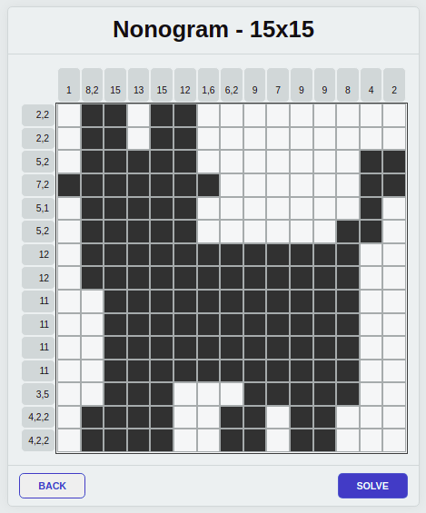
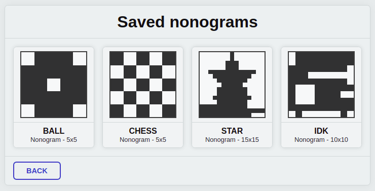

# [Nonogram Solver](https://0l1v3rr.github.io/nonogram-solver/)

 

  
This is a nonogram solver with a web UI.

## Features:
- Selectable grid size
- Error handling - unsolvable nonograms
- Nonogram solving
- Changeable parameters
- Responsive(ish)
- Save nonograms (local storage)
- Saved nonogram preview
- Delete saved nonograms
- Deployed to [GitHub pages](https://0l1v3rr.github.io/nonogram-solver/) - available 24/7

## Links
- [Stackoverflow](https://stackoverflow.com/questions/813366/solving-nonograms-picross)
- [Solver algorithm](https://lihautan.com/solving-nonogram-with-code/)
- [PDF](https://asset-pdf.scinapse.io/prod/2026240824/2026240824.pdf)
- [nonogram.com](https://nonogram.com/)